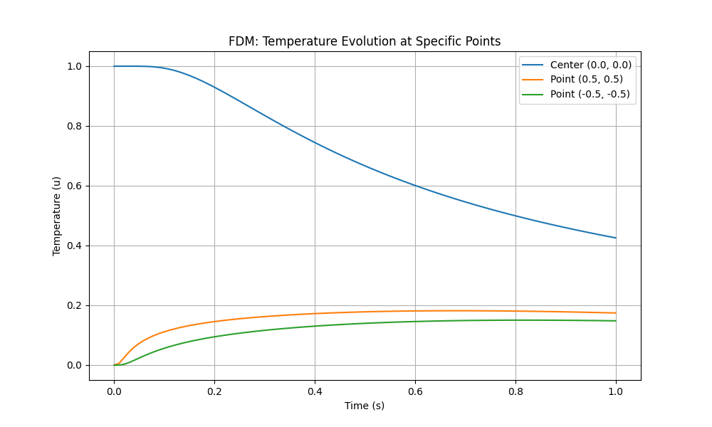
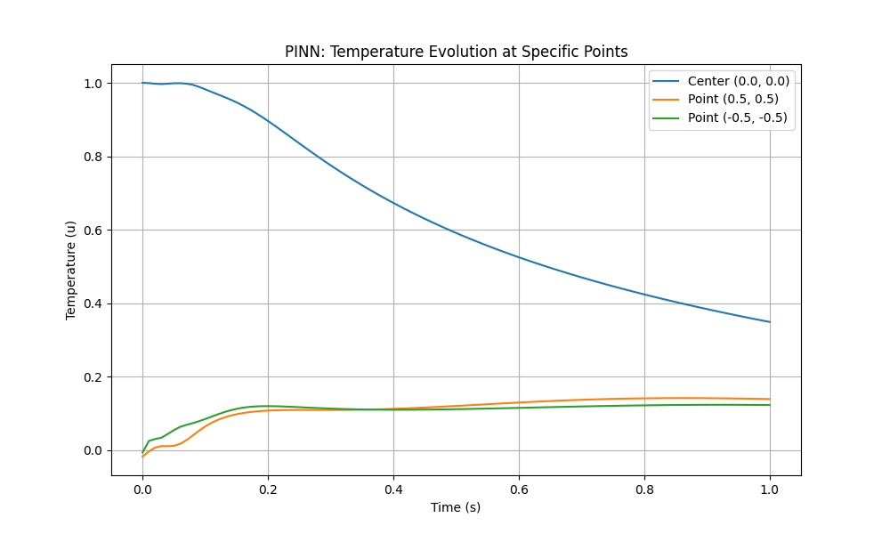
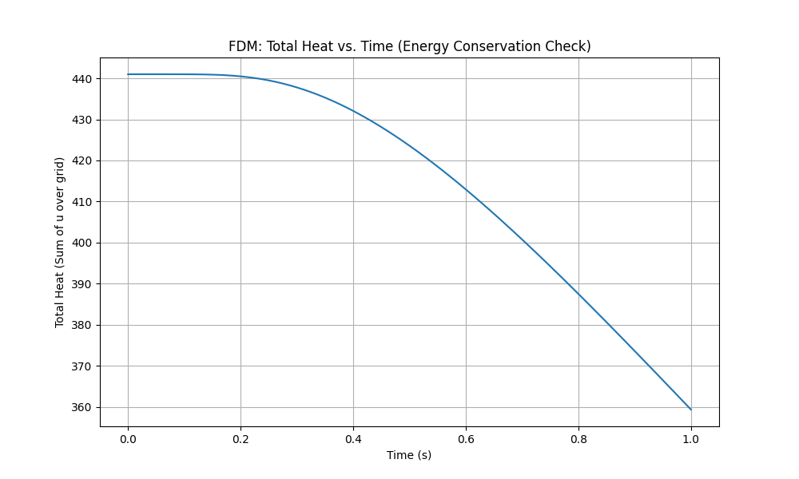
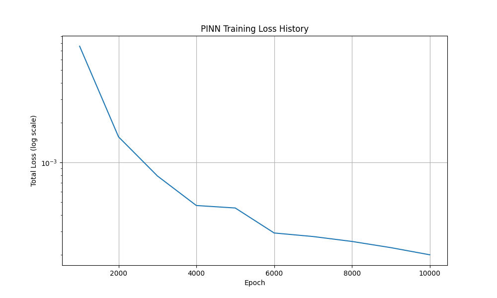

# Solvers for Partial Differential Equations: A Comparative Study of Classical and AI-Driven Methods

## 1. Overview
This section presents a comparative study of two different distinct paradigms of solving inverse problems in partial differential equations:

   (1) Classical PDE Constrained Optimization: Using a Finite Difference solver with gradient descent.
	
   (2) AI-Driven Physics-Informed Neural Network (PINN): Using a deep neural network to simultaneously learn the solution and the unknown parameter.
	
to more efficiently handle problems with significant high-frequency components.

This project showcases an end-to-end workflow, from theoretical formulation and implementation to validation and 
comparative analysis, demonstrating a deep understanding of both the underlying physics and the associated computational methodologies.

## 2. Visual Showcase: Simulation Results

The primary output of the solvers is a time-evolution animation of the temperature field. Below are the results from the classical FDM and the AI-driven PINN solver.

| **Finite Difference Method (FDM)** | **Physics-Informed Neural Network (PINN)** |
| :--------------------------------: | :----------------------------------------: |
|  |  |

## 3. The Problem Statement: 
Given a 2D metal plate where heat diffusion is governed by the heat equation:

 $$ \frac{\partial u}{\partial t} = \alpha \left( \frac{\partial^2 u}{\partial x^2} + \frac{\partial^2 u}{\partial y^2} \right) $$ 

 where $u(t, x, y)$ is the temperature and $α$ is the thermal diffusivity.

 - **The Unknown:** The theromal diffusivity  $\alpha = 0.1.$
 - **The Observation:** Sparse temperature measurements $u(t, x, y)$ from sensirs scattered across the plate.
 - **The Starting Point:** Initial guess of $\tilde{\alpha} = 0.5.$

 ## 4. Methodologies & Implementations
### 4.1 Classical Solver: Finite Difference Method (FDM) 
This solver discretizes the continuous domain into a 51x51 grid and steps forward in time using an explicit Euler method. It's a robust, well-understood technique that provides a ground-truth solution for comparison. The implementation includes a check for the CFL stability condition to ensure the simulation remains stable.

### 4.2 AI Solver: Physics-Informed Neural Network (PINN) 
This approach uses a deep neural network to learn a continuous approximation of the solution $u(t, x, y)$. The key features are: 
- **Mesh-Free:** The network is trained on randomly sampled collocation points, avoiding the need for a structured grid.
- **Hybrid Loss Function:** The network is optimized by minimizing a loss function composed of two parts:
  <!-- begin list --> 1. `loss_data`: Enforces the known initial and boundary conditions. 2. `loss_physics`: Enforces the PDE itself by using PyTorch's `autograd` to compute the derivatives and minimize the PDE residual. <!-- end list -->
  

## 5. Results & Comparative Analysis

In this section, we validate an AI-driven solution against the classical one. 
### 5.1: Quantitative Comparison: Time Evolution
The temperature evolution at specific points on the plate shows a strong agreement between the two methods, validating the accuracy of the PINN.

| **FDM: Evolution at Specific Points** | **PINN: Evolution at Specific Points** |
| :--------------------------------: | :----------------------------------------: |
|  |  |

### 5.2: Diagnostic Plots: Validation & Convergence
Both methods include diagnostic plots to verify their behavior. This comparison highlights the different validation paradigms for classical vs. AI solvers.
- **FDM**: Energy Conservation: The plot of total heat over time shows a smooth, monotonic decrease, correctly representing the physical dissipation of energy through the cold boundaries and confirming simulation stability.

- **PINN**: Loss History: The plot of the training loss shows a steady decrease over epochs, indicating that the optimization process successfully converged to a low-error solution.
  
| **FDM: Total Heat (Energy check)** | **PINN: Training loss** |
| :--------------------------------: | :----------------------------------------: |
|  |  |

## 6. How to Run the Code 
