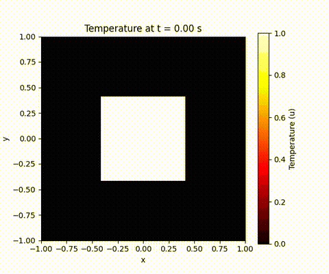
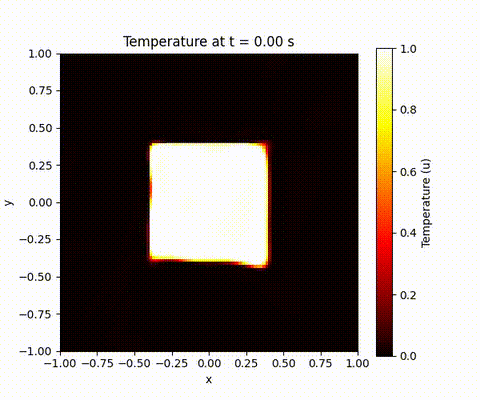

# Solvers for Partial Differential Equations: A Comparative Study of Classical and AI-Driven Methods

## 1. Overview
This repository presents a comparative study and implementation of different numerical methods for solving time-dependent partial differential equations (PDEs), 
specifically the 2D Heat Equation. The project bridges the gap between classical, battle-tested techniques and modern, AI-driven paradigms.

The core of this work includes the following solvers:

   (1) A Classical Finite Difference Method (FDM) Solver, serving as a robust and verifiable baseline.
	
   (2) An AI-Driven Physics-Informed Neural Network (PINN), which learns the continuous solution in a mesh-free domain.
	
   (3) A Novel Spectral Physics-Informed Neural Network (SPINN), a custom-designed architecture that operates in the Fourier domain 

to more efficiently handle problems with significant high-frequency components.

This project showcases an end-to-end workflow, from theoretical formulation and implementation to validation and 
comparative analysis, demonstrating a deep understanding of both the underlying physics and the associated computational methodologies.

## 2. Visual Showcase: Simulation Results

The primary output of the solvers is a time-evolution animation of the temperature field. Below are the results from the classical FDM and the AI-driven PINN solver.

| **Finite Difference Method (FDM)** | **Physics-Informed Neural Network (PINN)** |
| :--------------------------------: | :----------------------------------------: |
|  |  |

## 3. The Physical Problem: 2D Heat Diffusion

 $$ \frac{\partial u}{\partial t} = \alpha \left( \frac{\partial^2 u}{\partial x^2} + \frac{\partial^2 u}{\partial y^2} \right) $$ 

 where $u(t, x, y)$ is the temperature and $α$ is the thermal diffusivity.
 **Initial and Boundary Conditions:**
 - **Domain:** The plate is a square from $[-1, 1]$ in both x and y.
 - **Initial Condition (t=0):** The plate is at a temperature of 0, except for a hot square region from $[-0.4, 0.4]$ in the center, which is at a temperature of 1.
 - **Boundary Conditions (t \> 0):** The four edges of the plate are held at a constant temperature of 0 for all time (Dirichlet boundary conditions).

 ## 4. Methodologies & Implementations
### 4.1 Classical Solver: Finite Difference Method (FDM) 
This solver discretizes the continuous domain into a 51x51 grid and steps forward in time using an explicit Euler method. It's a robust, well-understood technique that provides a ground-truth solution for comparison. The implementation includes a check for the CFL stability condition to ensure the simulation remains stable.

### 4.2 AI Solver: Physics-Informed Neural Network (PINN) 
This approach uses a deep neural network to learn a continuous approximation of the solution $u(t, x, y)$. The key features are: 
- **Mesh-Free:** The network is trained on randomly sampled collocation points, avoiding the need for a structured grid.
- **Hybrid Loss Function:** The network is optimized by minimizing a loss function composed of two parts:
- <!-- begin list --> 1. `loss_data`: Enforces the known initial and boundary conditions. 2. `loss_physics`: Enforces the PDE itself by using PyTorch's `autograd` to compute the derivatives and minimize the PDE residual. <!-- end list -->

3. Classical Solver: Finite Difference Method

   
4. AI Solver: Physics-Informed Neural Network (PINN)

5. 
